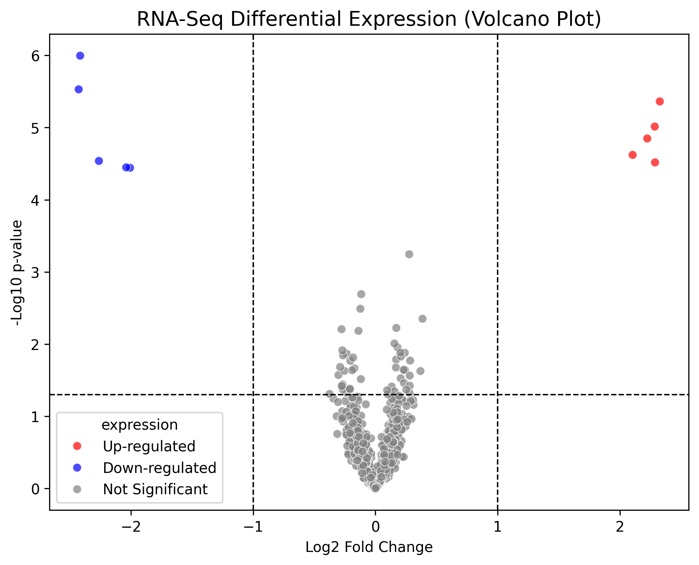

# RNA-Seq Differential Gene Expression & Pathway Enrichment Pipeline

An end-to-end Python workflow for analyzing transcriptomic count matrices, performing statistical differential expression testing with false discovery rate (FDR) adjustment, and executing functional pathway enrichment.

## Pipeline Features
- **Data Preprocessing:** Log2 normalization and low-count gene matrix filtering.
- **Statistical Analysis:** Two-sample t-test paired with Benjamini-Hochberg FDR correction.
- **Data Visualization:** Publication-ready Volcano plot categorizing up- and down-regulated genes.
- **Functional Annotation:** Integrated KEGG pathway enrichment via GSEAPy.

## Key Results

## Tech Stack
- Python 3.x
- Pandas & NumPy (Data Structuring)
- SciPy & Statsmodels (Statistical Testing & FDR)
- Seaborn & Matplotlib (Data Visualization)
- GSEAPy (Gene Set Enrichment Analysis)
